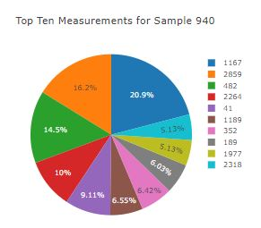
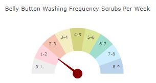
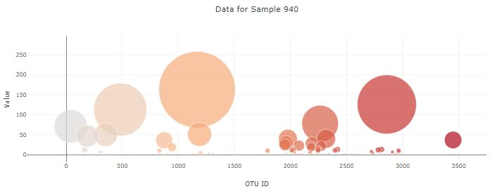

# plotly-challenge
### Summary
This repository contains an interactive dashboard to explore the Belly Button Biodiversity DataSet. 
### Technical Details
In order to run the code, it is required: 
* Python and SQLAlchemy 
* SQLAlchemy ORM queries, Pandas, and Matplotlib. 
### Screenshots
Pie.JPG 
  
GaugeGraph.JPG 
  
Bubble.JPG 
  
### Explanations 
The outcome is shown in screenshots for reference purpose of the public. 

# plotly-challenge
Belly Button Biodiversity 
Build an interactive dashboard to explore the Belly Button Biodiversity DataSet. 

Inside the local git repository, create a directory for the Plotly challenge. 
Use the folder name to correspond to the challenge: Belly_Button_Diversity. 
This is a full stack app so add the html, js, css, python and sqlite files. 

## Step 1 - Plotly.js 
Use Plotly.js to build interactive charts for your dashboard. 
Create a PIE chart that uses data from your samples route (/samples/<sample>) to display the top 10 samples. 
Use sample_values as the values for the PIE chart. 
Use otu_ids as the labels for the pie chart. 
Use otu_labels as the hovertext for the chart. 

Create a Bubble Chart that uses data from the samples route (/samples/<sample>) to display each sample. 
Use otu_ids for the x values. 
Use sample_values for the y values. 
Use sample_values for the marker size. 
Use otu_ids for the marker colors. 
Use otu_labels for the text values. 

Display the sample metadata from the route /metadata/<sample> 
Display each key/value pair from the metadata JSON object somewhere on the page. 
Update all of the plots any time that a new sample is selected. 
Create any layout for the dashboard. 

## Step 2 - Heroku 
Deploy your Flask app to Heroku. 
Use the provided sqlite file for the database. 
Optional Challenge 
Adapt the Gauge Chart from https://plot.ly/javascript/gauge-charts/ to plot the Weekly Washing Frequency obtained from the /metadata/<sample>route. 
Modify the example gauge code to show the top ten values ranging from 0 - 9. 
Update the chart whenever a new sample is selected. 

* Flask API 
Use Flask API starter code to serve the data needed for your plots. 
Test your routes by visiting each one in the browser. 
Pip install -r requirements.txt before starting the server. 
